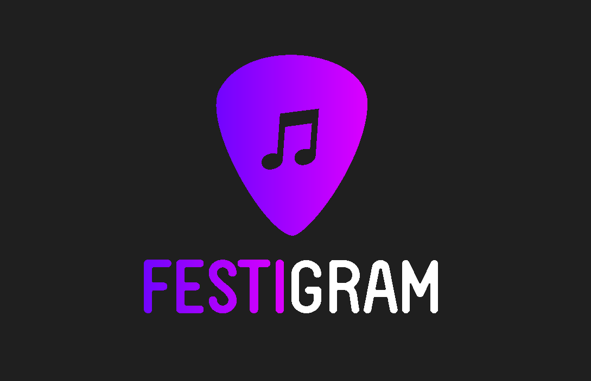
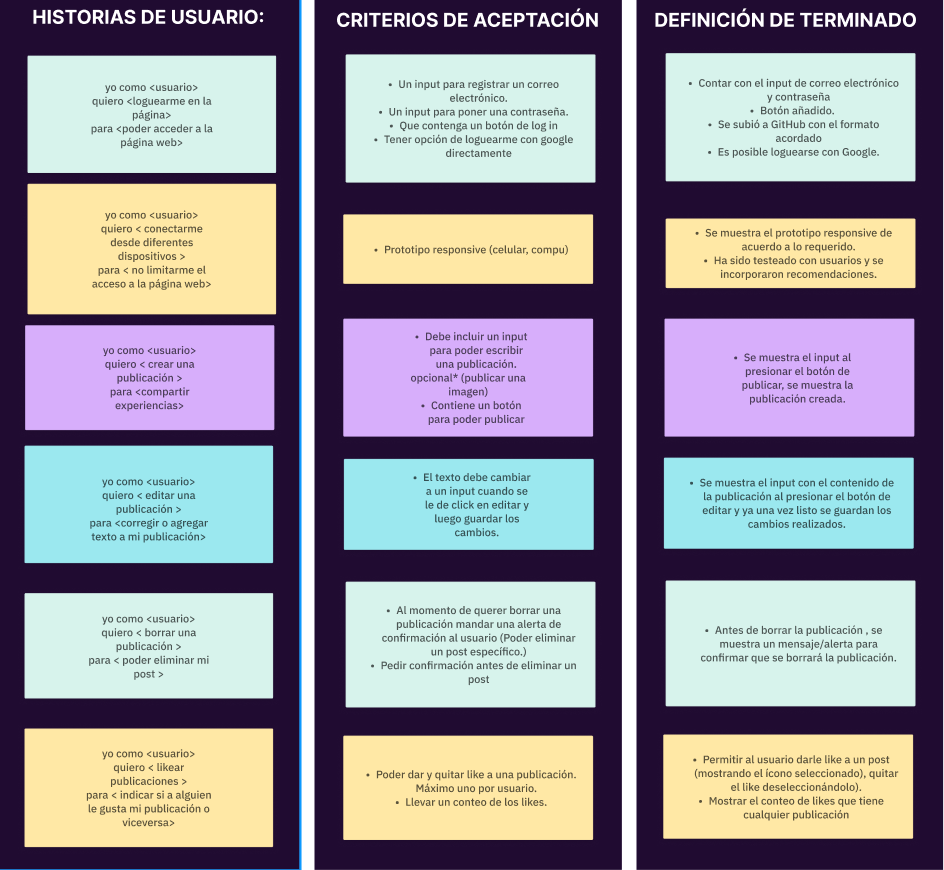
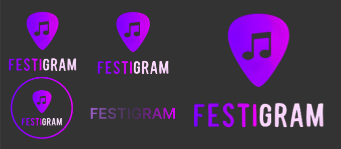
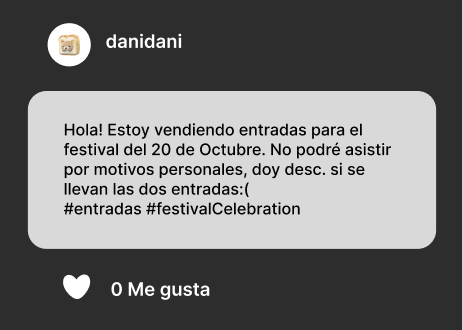
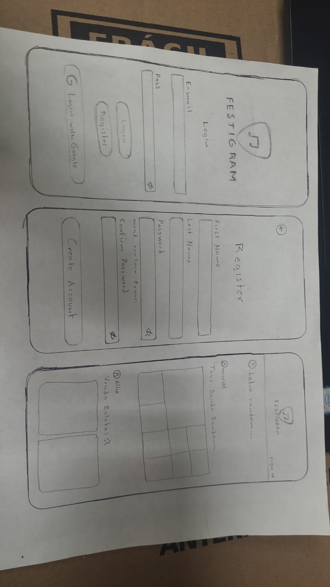
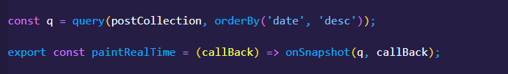
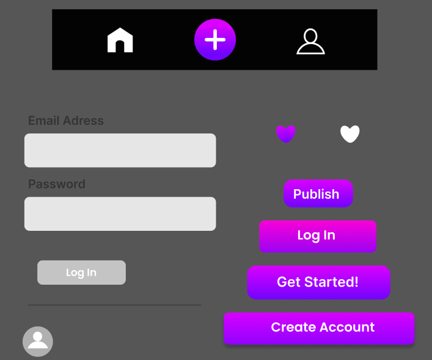
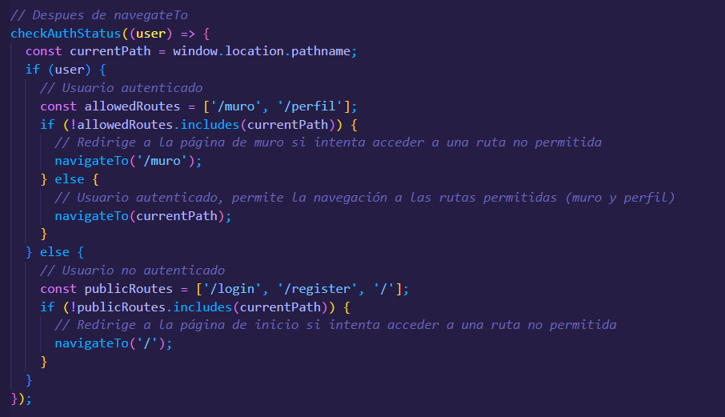

# Creando una Red Social

## Índice

* [1. Definición del producto](#1-definición-del-producto)
* [2. Historias de usuario](#2-historias-de-usuario)
* [3. Consideraciones técnicas UX](#3-consideraciones-técnicas-UX)
* [4. Diseño de la Interfaz de Usuario (prototipo de baja fidelidad)](#4-diseño-de-la-Interfaz-de-Usuario-(prototipo-de-baja-fidelidad))
* [5. Responsive](#5-responsive)
* [6. Consideraciones del comportamiento de la interfaz de usuario (UI)](#6-consideraciones-del-comportamiento-de-la-interfaz-de-usuario-(UI))
* [7. Prototipo de alta fidelidad (Figma)](#7-prototipo-de-alta-fidelidad-(Figma))

## 1. Definición del producto

Festigram es una red social enfocada en la difusión de eventos musicales internacionales solo para usuarios registrados, donde podrás publicar en tiempo real tus vivencias en conciertos, re-vender boletos extras que tengas y compartir letras de canciones que disfrutas escuchar.
Si te equivocaste en tu redacción, tranquilx. Puedes editar tu publicación en cualquier momento. Además de que podrás borrar tus publicaciones por si ya no están disponibles, pasadas de fecha o simplemente no quieres verlas más en tu feed. También puedes interactuar con las publicaciones de otros usuarios mediante el botón de “Like” y comunicar a los demás usuarios que te gustan sus post.

## 2. Historias de usuario

Nuestras historias de usuario se basaron en las necesidades principales de nuestros usuarios. Tomando en cuenta las interacciones que tienen las redes sociales para familiarizar a nuestros usuarios con Festigram y que su estadia en la nuestra sea llevadera. Todo ello para que los desarrolladores tengan una idea clara de las funcionalidades que se deben desarrollar creando un software intuitivo, amigable y que satisfaga los requerimientos.

## 3. Consideraciones técnicas UX

Nuestra red social fue desarrollada centrada en el usuario facilitando su comprensión y usabilidad. Esta aplicación fue creada en Ingles, un idioma que conecta al mundo con muchas personas ya que es el idioma más hablado. Podrá ser visitada por usuarios internacionales que no tendrán restricción alguna para navegar en ella.
Los usuarios podrán acceder mediante diferentes dispositivos:
- Desktop mode: nos presenta una interfaz que se puede visualizar en cualquier tamaño de computadora.

- Cell phone mode: se adapta a nuestro móvil para poder permitirnos navegar fácilmente desde cualquier lugar.

Para la creación de nuestro logotipo nos basamos en formas que representen la música y festivales de manera única e original. 

El nombre de nuestra red social fue elegido en base a encuestas realizadas a personas que suelen usar redes sociales en su vida cotidiana.

* Formulario para la eleccion de nombre y tematica

https://docs.google.com/forms/d/e/1FAIpQLSe1K6yPkFPOLyI_M3u_XI4C3mj-sUqt57iECw84AS1ocemQFQ/viewform?pli=1

Así mismo se eligieron los colores llamativos, generando un entorno que les haga alusión a un concierto, que sean agradables a la vista del usuario sin que estos sean excesivos y hagan contraste con la fuente implementada ( tamaño, color y tipo ).

 

## 4. Diseño de la Interfaz de Usuario (prototipo de baja fidelidad)

## 5. Responsive

## 6. Consideraciones del comportamiento de la interfaz de usuario (UI)

### 6.1 Creación de cuenta de usuario e inicio de sesión 

* Los usuarios nuevos en nuestra app pueden registrarse a través de un formulario que valida todos los campos. Esto garantiza que la información proporcionada sea correcta, lo que es importante para nosotros ya que nos ayuda a proporcionar una mejor experiencia de usuario asegurando la privacidad del mismo.

 

* Otra opcion para inicar sesion en nuestra app es utilizando su cuenta de gmail. Para hacerlo, simplemente deben hacer clic en el botón Iniciar sesión con Google. Luego ingresar su dirección de correo electrónico y contraseña de Google.

 

* Se implemento un mensaje de bienvenida para indicarle al usuario que accedió con éxito a nuestra aplicación, una ves iniciado nos redirecciona a nuestro feed, de modo que le muestra los post mas recientes, y los likes que tiene cada publicación.

 

* Al cerrar la sesión, el usuario es redirigido automáticamente a la pantalla de bienvenida. Esto le permite saber que ha cerrado la sesión y que ya no tiene acceso a la aplicación.

### 6.2 Muro/timeline

* En nuestra app, los posts se organizan cronológicamente, destacando lo más reciente primero. Esta elección tiene un propósito: mantener a los usuarios al tanto de las últimas novedades, asegurando que accedan a información relevante de inmediato. Esta forma de presentación está pensada para brindar una experiencia fluida, facilitando la interacción y participación activa de los usuarios con contenido fresco y actualizado.

* La opción de realizar publicaciones desde el feed agiliza la experiencia de navegación para nuestros usuarios. Al estar inmersos en el flujo de la aplicación, les resulta más sencillo compartir contenido sin interrupciones, mejorando así su interacción con la plataforma.

 

* La selección de colores para los botones se realizó considerando el entorno visual de nuestra red social y la aplicación en su totalidad. Esta elección se hizo para asegurar que los botones sean atractivos a la vista y fáciles de identificar durante la navegación. Además, cada botón está diseñado con una función específica que guía de manera intuitiva a los usuarios a través de la aplicación, manteniendo una experiencia de usuario coherente y funcional.

* Las publicaciones pasan por un proceso de validación para evitar contenido vacío o sin información relevante. Con la finalidad de mantener la calidad del contenido que se comparte en la plataforma ayudando a garantizar que los usuarios encuentren contenido útil, interesante y significativo cuando interactúan con la aplicación.

* Se creo una función para que los usuarios tengan la capacidad de editar o eliminar cada post que han creado. Esto permite una interacción personalizada con su contenido, asegurando una experiencia de usuario fluida y control total sobre sus publicaciones mientras están conectados a la plataforma.

* Al hacer clic en el botón de eliminar o editar, se abrirá una ventana modal. Esta ventana tiene como propósito mostrar claramente el post que está siendo editado o eliminado, brindando una confirmación visual y garantizando que el usuario pueda realizar la acción deseada con claridad y seguridad.

* Para mejorar la experiencia de nuestros usuarios, hemos implementado enrutamiento y autenticación dentro de la aplicación. Esta decisión garantiza que solo aquellos usuarios autenticados puedan acceder a las áreas del muro y perfil. Al requerir el inicio de sesión, creamos un espacio personalizado y seguro, brindando a los usuarios la posibilidad de explorar su muro y perfil de manera exclusiva. Esto no solo optimiza su experiencia, sino que también asegura un entorno confiable y adaptado a sus necesidades mientras interactúan con nuestra plataforma.

### 6.3 Consideraciones técnicas Front-end

Para la construcción de esta red social, se han utilizado varias tecnologías fundamentales:

**Jest:** 
Un marco de pruebas (testing framework) para JavaScript que se enfoca en la simplicidad y la velocidad. Jest se ha utilizado aquí para crear y ejecutar pruebas, garantizando la fiabilidad y el correcto funcionamiento de nuestro código.

**Vite:** 
Una herramienta de construcción de aplicaciones web que se centra en la velocidad y el rendimiento al manejar archivos JS (JavaScript). Vite nos ha permitido gestionar de manera eficiente los archivos JS de nuestra aplicación.

**Firebase:** 
Una plataforma de desarrollo de aplicaciones que ofrece varios servicios, incluida una base de datos en tiempo real y funcionalidades de autenticación. Hemos utilizado Firebase para interactuar con las colecciones creadas para usuarios y publicaciones, lo que nos ha permitido gestionar la información de manera eficaz y segura.

**Modelo Vista Controlador (MVC):** 
Un patrón de diseño utilizado para organizar y estructurar el código de una aplicación. Adoptar el modelo vista controlador ha permitido mantener una estructura sólida en el desarrollo de nuestra red social.

**JavaScript (JS):** 
Un lenguaje de programación ampliamente utilizado en el desarrollo web. En la creación de funciones y vistas, hemos utilizado JavaScript para cumplir con los requerimientos de una aplicación de página única (SPA), asegurando una experiencia fluida y dinámica para nuestros usuarios.

**CSS:** 
También hemos utilizado CSS para el diseño y estilos visuales de nuestra aplicación. CSS ha sido fundamental para definir la apariencia, el diseño y la presentación estética de cada elemento en la interfaz de usuario, asegurando una experiencia agradable y coherente para nuestros usuarios.

## 7. Prototipo de alta fidelidad (Figma)

Los prototipos de media y alta fueron desarrollados en Figma y se pueden ver en el siguiente enlace:
https://www.figma.com/file/SOY9zGWFzh0AcXBUzgOFA6/Untitled?type=design&node-id=1%3A2&mode=design&t=XHe3XF8CCFWgHtDe-1

